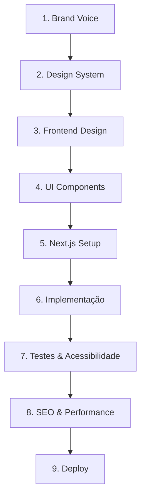

# Configuração de Skills - Site Elih

## ✅ Skills Importadas com Sucesso

Todas as skills globais estão disponíveis para este projeto! Você tem acesso a **200+ skills** centralizadas em:
```
c:\Users\gabri\.claude\skills\
```

---

## 🎨 Skills de Design Recomendadas

Para criar um site profissional, use estas skills nesta ordem:

### 1️⃣ **Brand Voice & Identidade**
```
/frontend-design
```
**O quê:** Define estilo visual, paleta de cores, tipografia
**Exemplo de uso:**
```
@frontend-design Defina a identidade visual para um site de seguros moderno
```

### 2️⃣ **Design System**
```
/design-system
```
**O quê:** Cria componentes reutilizáveis e tokens de design
**Exemplo de uso:**
```
@design-system Crie tokens de spacing, cores e tipografia baseado em Tailwind
```

### 3️⃣ **Frontend Design**
```
/frontend-design
```
**O quê:** Prototipa páginas, components, layouts responsivos
**Exemplo de uso:**
```
@frontend-design Crie wireframes para: Hero, Features, Pricing, Contact
```

### 4️⃣ **Liquid Glass Design** (Opcional - Efeitos Modernos)
```
/liquid-glass-design
```
**O quê:** Adiciona efeitos glassmorphism e animações modernas
**Exemplo de uso:**
```
@liquid-glass-design Adicione glassmorphism cards à seção de seguros
```

---

## 💻 Skills de Desenvolvimento

### 5️⃣ **Next.js + Turbopack**
```
/nextjs-turbopack
```
**O quê:** Configura e otimiza o framework
**Exemplo de uso:**
```
@nextjs-turbopack Crie estrutura de projeto otimizada com app router
```

### 6️⃣ **Frontend Patterns**
```
/frontend-patterns
```
**O quê:** Implementa padrões React/Next.js
**Exemplo de uso:**
```
@frontend-patterns Mostre padrões de state management e custom hooks
```

### 7️⃣ **API Design**
```
/api-design
```
**O quê:** Design de endpoints se houver backend
**Exemplo de uso:**
```
@api-design Crie estrutura de API routes do Next.js
```

---

## 🎯 Skills de Qualidade & Acessibilidade

### 8️⃣ **Accessibility**
```
/accessibility
```
**O quê:** Garante conformidade WCAG
**Exemplo de uso:**
```
@accessibility Verifique acessibilidade dos componentes
```

### 9️⃣ **SEO**
```
/seo
```
**O quê:** Otimização para mecanismos de busca
**Exemplo de uso:**
```
@seo Implemente meta tags, Schema.org para site de seguros
```

### 🔟 **E2E Testing**
```
/e2e-testing
```
**O quê:** Testes end-to-end (Cypress/Playwright)
**Exemplo de uso:**
```
@e2e-testing Crie testes para fluxo de cotação de seguros
```

---

## 🚀 Skills de Deployment

### **Deployment Patterns**
```
/deployment-patterns
```
**O quê:** Estratégia de release e CI/CD
**Exemplo de uso:**
```
@deployment-patterns Configure GitHub Actions para Next.js
```

### **Docker Patterns**
```
/docker-patterns
```
**O quê:** Containerização
**Exemplo de uso:**
```
@docker-patterns Crie Dockerfile otimizado para Next.js
```

---

## 📋 Plano de Execução Recomendado



---

## 🛠️ Como Usar Skills em Este Projeto

### Opção 1: Invocar Diretamente (Recomendado)
```bash
# No prompt, use:
@frontend-design [sua instrução]

# Ou via comando do Claude Code
/frontend-design
```

### Opção 2: Referenciar em Arquivo
```markdown
# README.md
Para design, veja: /c/Users/gabri/.agents/skills/frontend-design/README.md
```

### Opção 3: Copiar Skill para Projeto (Avançado)
```bash
# Se precisar uma cópia local:
cp -r /c/Users/gabri/.agents/skills/frontend-design ./.claude/skills/
```

---

## 📊 Estrutura de Skills Disponíveis

```
c:\Users\gabri\.claude\skills\
├── 🎨 Design (15 skills)
│   ├── frontend-design
│   ├── design-system
│   ├── liquid-glass-design
│   ├── ui-demo
│   ├── brand-voice
│   └── ... (10 mais)
│
├── 💻 Frontend (25 skills)
│   ├── nextjs-turbopack
│   ├── frontend-patterns
│   ├── api-design
│   └── ... (22 mais)
│
├── ⚙️ Backend (30 skills)
│   └── ... (para quando precisar)
│
├── 🧪 Testing (20 skills)
│   ├── e2e-testing
│   ├── accessibility
│   └── ... (18 mais)
│
└── 🚀 DevOps (30+ skills)
    ├── docker-patterns
    ├── deployment-patterns
    └── ... (28+ mais)
```

---

## 🎓 Exemplo Prático: Criar Hero Section

```
Prompt de Exemplo:
@frontend-design Crie uma hero section moderno para site de seguros
- Headline impactante
- CTA button
- Background image ou gradient
- Responsivo (mobile/desktop)

Depois:
@liquid-glass-design Adicione um glassmorphism card com benefícios
```

---

## ❓ Troubleshooting

### Skills não aparecem no autocomplete?
```
✅ Elas ainda funcionam! Use manualmente:
@frontend-design [sua instrução]
```

### Preciso de uma skill que não vejo?
```
✅ Você tem 200+ disponíveis em:
c:\Users\gabri\.claude\skills\

❌ Procure por keywords:
- "pattern" → padrões de código
- "testing" → testes
- "security" → segurança
- "deploy" → deployment
```

### Como ver todas as skills?
```bash
ls -la c:\Users\gabri\.claude\skills\ | grep -E "^\l"
```

---

## 🔗 Links Rápidos

- **Configuração do Projeto:** `.\.claude\settings.json`
- **Skills Documentadas:** `.\.claude\project-skills.md`
- **Skills Globais:** `c:\Users\gabri\.claude\skills\`
- **Seu Email:** elihseguros@gmail.com

---

## ✨ Próximos Passos

1. ✅ Skills importadas
2. ⏭️ Defina a identidade visual (@brand-voice)
3. ⏭️ Crie o design system (@design-system)
4. ⏭️ Prototipe páginas (@frontend-design)
5. ⏭️ Implemente em Next.js (@nextjs-turbopack)
6. ⏭️ Teste acessibilidade e SEO
7. ⏭️ Deploy

**Pronto para começar! 🚀**
